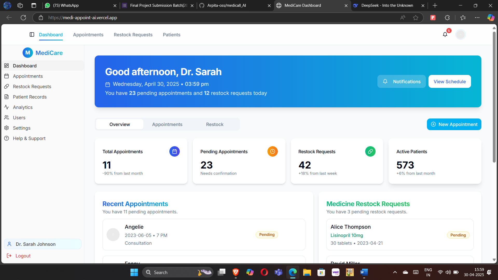

# MediCall AI – Medical Voice Assistant 🤖📞

##Live Linnk = https://medi-appoint-ai.vercel.app/restock-requests

**MediCall AI** is a voice-enabled medical assistant powered by AI that allows users to receive preliminary health advice and book doctor appointments—**all through a simple phone call**. It uses Twilio for voice calls, Whisper for transcription, Gemini for AI medical analysis, and ElevenLabs for lifelike voice responses. It also features a **Next.js dashboard** to manage all appointments received via calls.

---

## ✨ Features

- ☎️ Voice-based calling using Twilio
- 🧠 Medical query analysis with **Google Gemini**
- 🗣️ Natural responses via **ElevenLabs TTS**
- 🧾 Real-time transcription via **Whisper**
- 📅 **Voice-enabled appointment booking**
- 💻 Appointment dashboard built with **Next.js**
- 📝 Call logging & audio file storage

---

## 🛠️ Tech Stack

| Feature                  | Technology               |
|--------------------------|--------------------------|
| Voice Calling            | Twilio Voice             |
| Speech Recognition       | Whisper (local)          |
| AI Analysis              | Google Gemini            |
| Text-to-Speech           | ElevenLabs               |
| Backend Server           | Node.js + Express        |
| Frontend Dashboard       | Next.js                  |
| Tunneling (for testing)  | ngrok                    |

---

## ⚙️ Setup & Installation

### 1. Clone the Repository

git clone https://github.com/Arpita-oss/medicall_AI.git
cd medicall_AI

## 2. Install Backend Dependencies
npm install

# #3. Set Up Environment Variables
NGROK_URL=https://your-ngrok-subdomain.ngrok-free.app
GOOGLE_API_KEY=your_gemini_api_key
TWILIO_ACCOUNT_SID=your_twilio_sid
TWILIO_AUTH_TOKEN=your_twilio_token
ELEVENLABS_API_KEY=your_elevenlabs_key
WHISPER_PROMPT="Medical symptom description"

## 4.🚀 Running the Application
1. Start the ngrok Tunnel
   
ngrok http 3000 --host-header=rewrite

## 5. Start the Express Backend Server
npm start

## 6. Set the Twilio Webhook
In your Twilio Console, set:
Voice Webhook URL: https://your-ngrok-url/voice
Method: POST

## 7. Running the Dashboard (Next.js)
npm install
npm run dev
Dashboard will run at: http://localhost:3001

## 📞 Appointment Booking Flow
When the user calls and says:

"I want to book an appointment"

The system will ask:

🧑 Patient's name

📆 Date of appointment

⏰ Time of appointment

👨‍⚕️ Doctor's name

All responses are saved and shown in the dashboard in real-time.

